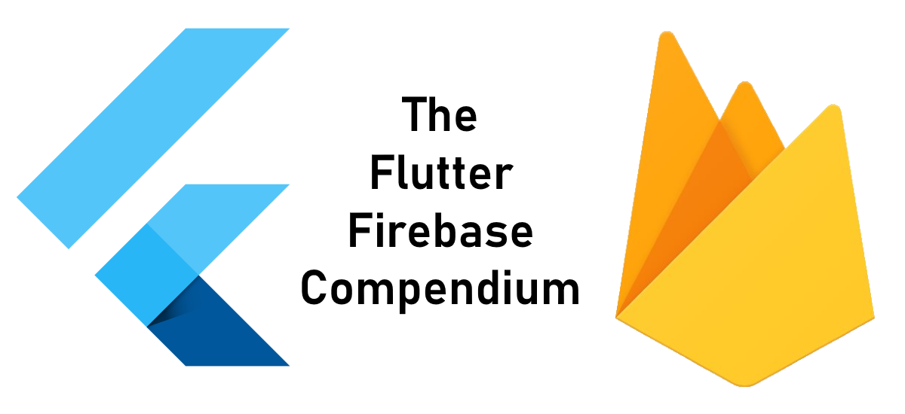
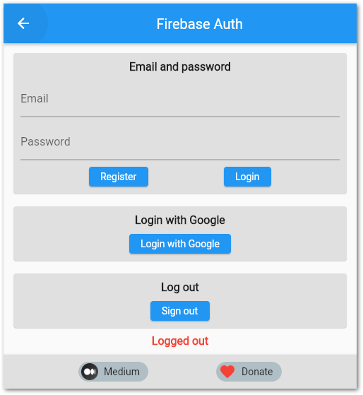
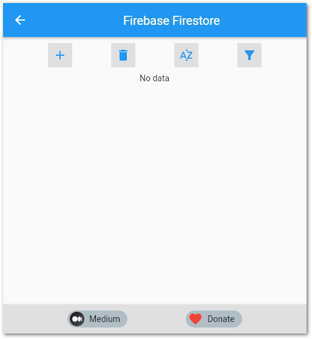
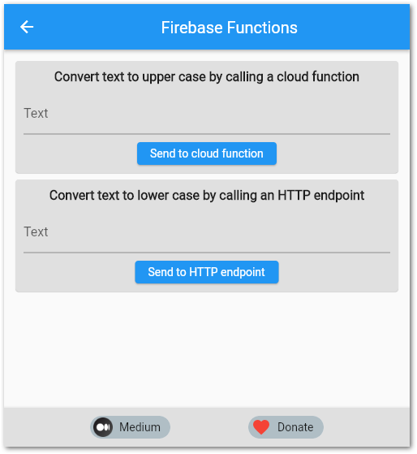
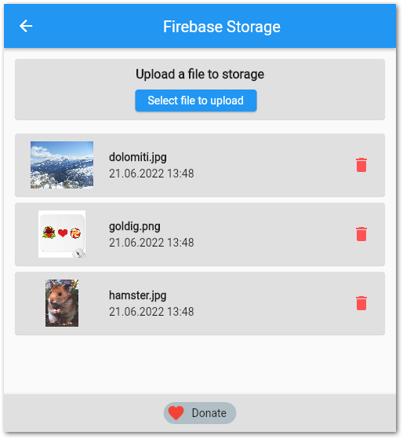

# The Flutter Firebase Compendium Demo Application

This is the companion app of the Flutter Firebase Compendium with code examples.

The Flutter Firebase Compendium is an article series published on [Medium](https://medium.com/@xeladu/list/the-flutter-firebase-compendium-2ec07e25baba) and as an e-book (coming soon). It explains how to use Firebase services from a Flutter application.

## Content

- 🔹 [Firebase project setup](https://medium.com/gitconnected/how-to-create-a-firebase-project-and-link-it-with-your-flutter-app-acd826be8356)
- 🔹 [Firebase Authentication](https://levelup.gitconnected.com/how-to-use-firebase-authentication-with-your-flutter-app-4603c1b78156)
- 🔹 [Firebase Cloud Firestore](https://levelup.gitconnected.com/how-to-use-firebase-cloud-firestore-with-a-flutter-app-2110da689e08)
- 🔹 [Firebase Cloud Functions](https://levelup.gitconnected.com/how-to-work-with-firebase-cloud-functions-from-a-flutter-app-fb818c01b0db)
- 🔹 [Firebase Storage](https://medium.com/gitconnected/how-to-easily-store-objects-in-firebase-storage-from-your-flutter-app-deabc475d407)
- 🔹 Firebase App Check (coming soon)
- 🔹 Firebase Remote Config (coming soon)
- 🔹 Firebase Dynamic Links (coming soon)

## App screenshots

  
  
  

  

## How to run the code

The code uses Firebase as a backend but the Firebase configuration is not included. You have to add it yourself because there are paid features that might cause costs. Refer to [this article](https://medium.com/gitconnected/how-to-create-a-firebase-project-and-link-it-with-your-flutter-app-acd826be8356) above on how to perform the necessary steps in detail.

1. Create a Firebase project
2. Install [Firebase CLI](https://firebase.google.com/docs/cli)
3. Install [FlutterFire CLI](https://pub.dev/packages/flutterfire_cli)
4. Check out the code
5. Execute `firebase login` from the app root folder and log into your created Firebase project
6. Execute `flutterfire configure` from the app root folder and use your created Firebase project
7. A file `firebase_options.dart` will be created in your `lib` folder
8. Execute `firebase deploy --only functions` to deploy the demo functions
9. Set security rules for Storage and Firestore
10. Register an attestation provider and enforce App Check
11. Run the app

## Hints

- 💡 Social sign-in only works on web platform
- 💡 You need to replace the link on `functions_page.dart` according to your deployed function link!
- 💡 Don't forget to set the security rules for Storage and Firestore!
- 💡 To get file downloads from Firebase Storage work on the web platform, you need to set specific [CORS rules](https://firebase.google.com/docs/storage/web/download-files#cors_configuration)!
- 💡 [The Play Integrity attestation provider is not working](https://github.com/firebase/flutterfire/issues/9178) at the moment. Use SafetyNet as replacement!

## Platforms

Overview of supported platforms of the used [Firebase packages](https://firebase.google.com/docs/flutter/setup?platform=ios#add-plugins).

✔ - supported ❌ - not supported

||Android|iOS|Web|MacOS|Windows|Linux|
|---|:-:|:-:|:-:|:-:|:-:|:-:|
|[Authentication](https://pub.dev/packages/firebase_auth)| ✔ | ✔ | ✔ | ✔ | ❌ | ❌ |
|[Firestore](https://pub.dev/packages/cloud_firestore)| ✔ | ✔ | ✔ | ✔ | ❌ | ❌ |
|[Functions](https://pub.dev/packages/cloud_functions)| ✔ | ✔ | ✔ | ✔ | ❌ | ❌ |
|[Storage](https://pub.dev/packages/firebase_storage)| ✔ | ✔ | ✔ | ✔ | ❌ | ❌ |
|[App Check](https://pub.dev/packages/firebase_app_check)| ✔ | ✔ | ✔ | ✔ | ❌ | ❌ |

## Support

If you like this repository or my work in general, feel free to support me in any way ❤

- You can [become a Medium member](https://medium.com/@xeladu/membership) with my referral link for just $5 a month 💖
- You can [buy me a coffee](https://www.buymeacoffee.com/xeladu) ☕
- You can [donate via PayPal](https://www.paypal.com/donate/?hosted_button_id=JPWK39GGPAAFQ) 🎁
- You can [check out my freebies and curated lists](https://linktr.ee/xeladu) 📣
- You can buy my e-book (coming soon) or visit [my Gumroad store](https://xeladu.gumroad.com/) 📗
